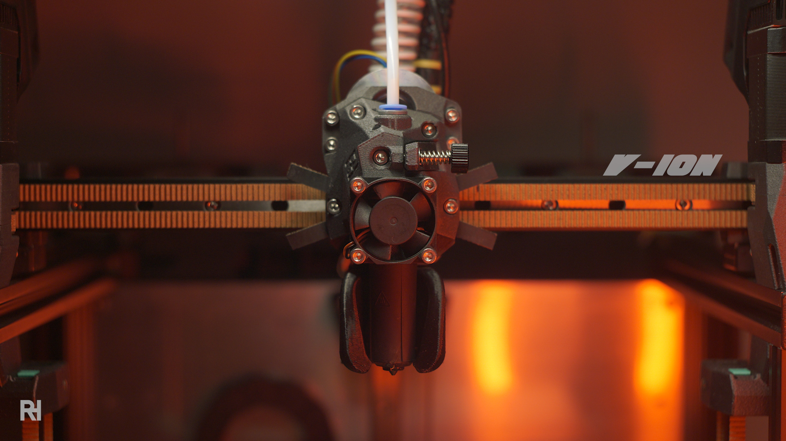

# V-ION
{: .text-center }

{: .warning }
**THE SITE IS UNDER CONSTRUCTION**
{: .text-center }

**Originally developed as the core toolhead for the Virtu E3, the V-ION was designed with a single goal: to be a no-compromise, high-performance platform for extreme speeds.**
{: .text-center }

## QUICK SPECS

 - **Featherweight:** ~260 g (fully loaded).
 - **Mass Balanced:** Center of gravity optimized to eliminate artifacts at high G-forces.
 - **Integrated Rigidity:** Compact design with a rock-solid base and ultra-short filament path.
 - **Aero-Tuned:** CFD-optimized cooling ducts for high speed printing.
 - **Universal Mount:** Voron-compatible (MGN12H) for easy installation on various printers.
 - **Performance Focused:** Native support for UHF hotends and high-speed eddy-current probes.

{: .warning }
More details, including additional webpage content and a full structure for the V-ION project, will be added here later. For now, you can access the latest project files at the link below and find the design overview further down this page.

[PRINTABLES]{: .btn .fs-7 .fw-300 .mt-6 .mb-8 .text-yellow-300 }
{: .text-center }

---

The V-ION is more than just a part of the Virtu project. Because it uses a Voron-compatible mounting pattern, I decided to make it available as a standalone project. Whether you are building a Virtu or looking to upgrade a Voron or another CoreXY machine, the V-ION offers a level of optimization that is hard to find in "universal" toolheads. It is built for those who care about the fine details of fluid dynamics, mass distribution, and rigid extrusion.

# DESIGN FOCUS & KEY FEATURES
{: .text-center }

## BALANCE & CENTER OF GRAVITY

High acceleration is useless if your toolhead is fighting its own weight. The V-ION has been meticulously designed to keep the center of gravity as close to the linear rail as possible. By optimizing the mass distribution, we significantly reduce the leverage effect on the carriage, which means fewer artifacts, less ringing, and better results when pushing high G-forces.

## COMPACT, RIGID, AND LIGHTWEIGHT

The V-ION isn't just a collection of parts; it's an integrated system. By using a central base plate as the backbone, the design remains incredibly rigid while keeping the weight down to just ~260g (including hotend, probe, and fans). The tightly spaced assembly allows for an extremely short and well-constrained filament path, giving you superior control over flow and retractions.

## CFD REFINED PART COOLING

When printing at high speeds, standard cooling isn't enough. The V-ION fanducts have gone through countless iterations of CFD (Computational Fluid Dynamics) analysis. The internal geometry is optimized to deliver high-velocity, targeted airflow exactly where it’s needed at the nozzle, ensuring that even at extreme speeds, your layers are cooled before the next one arrives.

## VORON COMPATIBILITY

To make the V-ION accessible to more makers, it uses the standard Voron mounting pattern. It is designed for MGN12H rails and standard belt spacing, making it a drop-in upgrade for the Voron family or any printer utilizing that ecosystem.

## PERFORMANCE-FIRST COMPONENTS

To achieve this level of optimization, the V-ION focuses on specific, high-performance hardware. Trying to support every product on the market would mean cutting corners in the design—something I wasn't willing to do.
 - **HOTENDS:** Native support for Phaetus Rapido UHF, Goliath AIR or Trianglelab CHC XL.
 - **PROBES:** Cartographer3D od Beacon Scanner
 - **PART COOLING:** 5015 or CPAP
 - **THE ROADMAP:** While the focus is on top-tier performance, I am currently working on adapting more budget-friendly options like the BDsensor and PCBKlicky without compromising the core design.

[PRINTABLES]: https://www.printables.com/model/1692067
