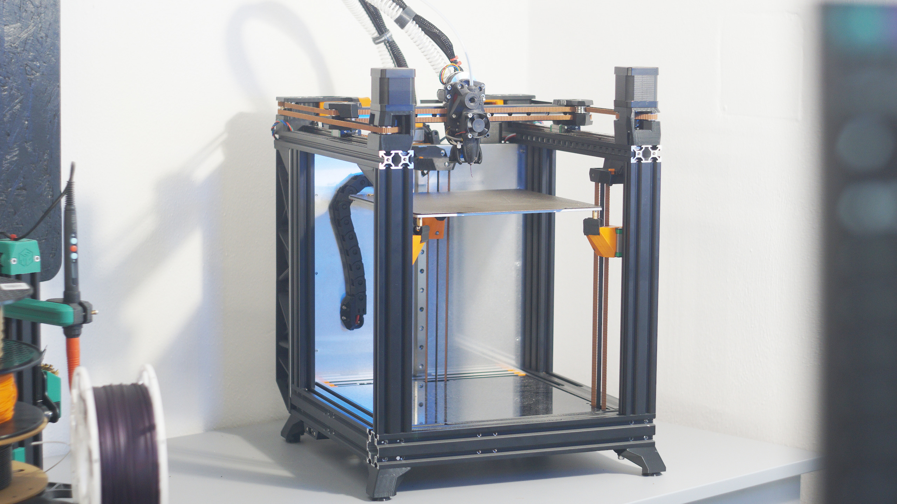

# VIRTU E3
{: .text-center }

**Take your old, faithful Ender 3 and transform it into a high-performance beast. Virtu E3 is the next evolution in DIY upcycling—a ground-up redesign focused on excellence, precision, and raw speed.**
{: .text-center .mb-6 }

The name comes from "Virtue"—representing excellence, strength, and purity of design. While this project started as a successor to the E3NG, it has evolved into a completely different animal. It’s more compact, significantly more rigid, and designed for those who want to push the absolute limits of what "budget" hardware can do. Whether you are converting an Ender 3 Pro or building the **VIRTU** as a standalone high-speed machine, you are building a printer that honors its roots while outperforming the industry standard.

The soul of Virtu is still about rescue and reuse. Many of us started with an Ender 3, and instead of letting those parts gather dust, Virtu gives them a second life at the cutting edge of 3D printing. It is a machine for the "Speed Freaks" who still value the art of the upcycle.

---

#### PRINTER PERFORMANCE
- **Target Acceleration:** 35,000+ mm/s2 (X) / 18,000+ mm/s2 (Y)
- **Print Speed:** 600+ mm/s
- **Build Volume (X-Y-Z):** 230 x 230 x 230 mm
- **Footprint:** 35 x 40 x 50 cm *(roughly 6cm narrower than E3NG)*

#### KEY FEATURES
*Performance Focused Design: Every component is engineered to handle extreme accelerations while maintaining flawless print quality.*
- Ultra-Rigid frame using 2040 and 4040 extrusions with blind joints, no printed joints.
- Linear rails on all axes.
- Belt driven Z axis with a 2.5:1 reduction, no leadscrew artifacts, higher speeds, less maintenance.
- Three independent Z motors and kinematic mounts for automated bed tilt adjustment.
- OG Ender 3 bed with kinematic mounts allow for natural expansion during heating, reducing warp.
- PSU in the base for lower center of gravity, spacious rear compartment for DIN-rail organization.

#### THE V-ION TOOLHEAD
*Virtu debuts the custom V-ION toolhead, a high-performance project in its own right:*
- **Lightweight:** Only ~260 g (including hotend, bed probe and fans).
- **Integrated Design:** A compact, rigid assembly with a very short, well-constrained filament path.
- **CFD Optimized Cooling:** Part cooling ducts refined through fluid dynamics for high-speed printing.
- **Center of Mass Optimized:** Perfectly balanced to reduce vibrations and artifacts at high G-forces.
- **Universal Mounting:** Voron mounting pattern for compatibility across different machines.

#### OFFICIAL UPGRADES
*Performance packs designed to push the hardware to its absolute limit:*
- **4WD** - quad-motor setup for insane torque and higher resonance frequencies.
- **Double-Shear Mounts** - supported motor shafts to handle high belt tensions.
- **CPAP Part Cooling** - remote high-pressure cooling for the most demanding high-speed printing.
- **Active Motor Cooling** - built-in cooling and thermistor support to keep XY steppers cool.
- **In Progress:** Enclosure and CNC Aluminum parts for the ultimate build.

#### OFFICIAL MODS (STILL IN PROGRESS)
- Klicky Probe
- BDsensor
- MGN12H rails on all axes

---
A Note on the Build: Virtu E3 is about more than just assembly—it’s a project. To achieve this level of rigidity, you will need to drill new holes into your profiles for the blind joints. It’s an extra step that pays off with a cleaner, faster, and more precise machine than any other conversion.
